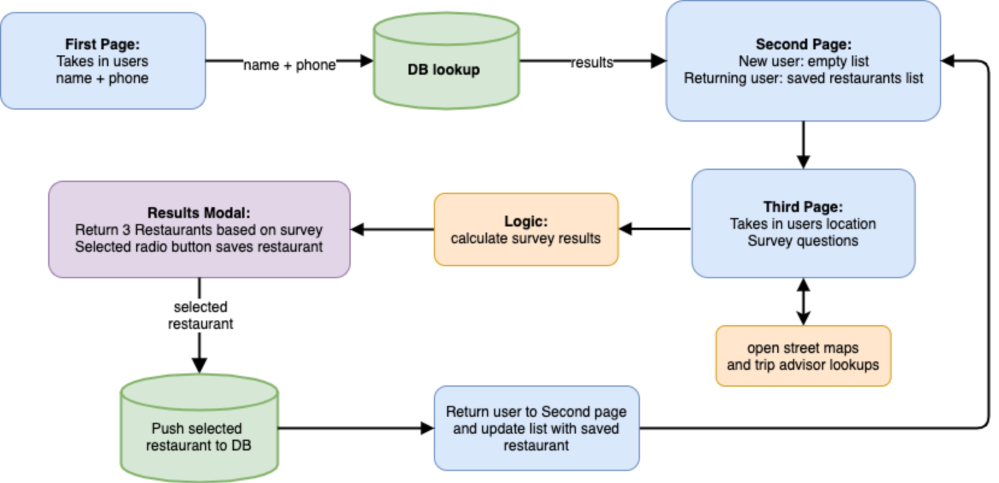

# RESTAURANT FINDER 🍴🍕🍜🥗

Find a restaurant [here](https://best-restaurant.herokuapp.com/)

## Overview
Can’t decide where to eat?
We’ve been there...

That’s why we created Restaurant Finder. 

An 11 question survey takes in your location, cravings, dietary restrictions, favorites and more, to help you find a restaurant in your area or town you’re visiting.

Finally put an end to the never ending… “I don’t know where to eat, where do you want to eat?”
 
Because we know everyone hates that conversation.

---

## App Features
### 1. Enter Name and Phone number


---
### 2. User landing page: When new user, message will display "You have no saved restaurants." Restaurant Finder Survey button takes user to survey


---
### 3. Survey page takes in users food preferences, cravings, dietary restrictions, etc.


---
### 4. User selects which restaurant they want to eat at based on the survey results, and saves their restaurant of choice to their "Previously visited restaurants" list, when a user returns to the app they can reference which restaurants they have already eaten at


---

This is a full stack application using Node, Express, Handlebars, MySQL, and Sequalize ORM

---

## Technologies Used
- Handlebars/HTML (https://handlebarsjs.com/guide/)
- Bootstrap/Custom CSS (https://getbootstrap.com/)
- MySQL Database (https://www.mysql.com/)
- Sequelize ORM (https://sequelize.org/) 
- jQuery (https://jquery.com/)
- JavaScript (https://developer.mozilla.org/en-US/docs/Web/JavaScript)
- SurveyJS (https://surveyjs.io/)
- Open Street Map API (https://wiki.openstreetmap.org/wiki/API)
- TripAdvisor API (https://rapidapi.com/apidojo/api/tripadvisor1?endpoint=apiendpoint_c0d6decf-e541-447d-bc87-2fa023cd96d6)
- Node.js (https://nodejs.org/en/)
- Deployed with Heroku (https://www.heroku.com/)

---

## Process Flow


---

## If you want to clone the app down to your local machine:
1. Visit [here](https://rapidapi.com/apidojo/api/tripadvisor1?endpoint=apiendpoint_c0d6decf-e541-447d-bc87-2fa023cd96d6) to set up your own TripAdvisor API key.
- Create and set up your own ```.env``` file as follows:
```
#api keys
TRIP_KEY=<your api key here>
```
- Add your ```.env``` file to your ```.gitignore``` file
2. Use MySQL Workbench to create a database called ```restaurant_db```
- The raw SQL query is ```CREATE DATABASE restaurant_db;```
3. Inside the config folder, open up the ```config.json``` file
- In the development object, add your MySQL localhost ```password```
4. In your terminal, ```cd``` into the project folder and run:
- ```npm install``` to download all node.js dependencies
- ```npm install sequelize``` to install Sequelize
5. Finally, you can run the application using:
- ```node server.js``` in the terminal to start the node server
- Navigate to localhost:3000 in your browser.

---

## Acknowledgments
- Unsplash (https://unsplash.com/) Attribution free photography

## Authors
- Kevin Brown - [kbrowngithub](https://github.com/kbrowngithub)
- Nathaniel Anderson - [Nathaniel-DU](https://github.com/Nathaniel-DU)
- Jodi Tivis - [joditivis](https://github.com/joditivis)